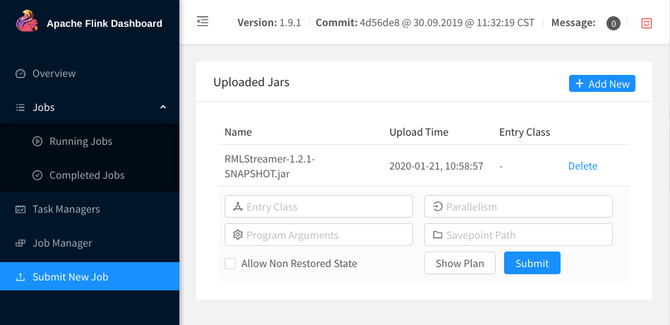
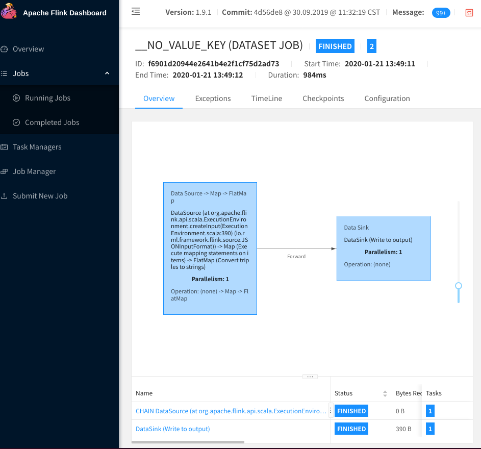

# Running RMLStreamer with Docker

Get RMLStreamer up and running using Docker. No Java, no Flink, no Maven required.

*Note: this README descibes one way of setting up Flink + RMLStreamer in Docker.
Check out Flink's elaborate [documentation](https://ci.apache.org/projects/flink/flink-docs-release-1.14/docs/deployment/resource-providers/standalone/docker/) on this topic for more options, configurations, ...*

## 1. Prerequisites
- [Docker or Docker Engine](https://www.docker.com/), version 19 or higher
- [docker-compose](https://docs.docker.com/compose/), version 3 or higher
- Have the `docker-compose.yml` file locally (either by cloning this repo or just by copying the file).
This is just *a* possible configuration; you can adjust it to your needs. 
- An RMLStreamer jar file, either from the [latest release](https://github.com/RMLio/RMLStreamer/releases/latest),
or one that you build yourself (in which case you *do* need Java and Maven).

## 2. Start the Flink cluster

Go to the directory where you put the `docker-compose.yml` file.

Run:

```
$ docker-compose up
```

This will start one Flink Job Manager and one Flink Task Manager. If you want to scale up and add more Task Managers,
just run the following command (in another terminal):

```
$ docker-compose up --scale taskmanager=2
```

Replace the `2` with the number of Task Managers you actually want to have.

The task managers will get a Docker volume `data` mounted. We will use this to put the mapping file and other input.
You can see this volume with name `docker_data` in Docker by running:

```
$ docker volume ls

DRIVER              VOLUME NAME
...
local               docker_data
...
``` 

If you want to know more details about the volume:

``` 
docker volume inspect docker_data
```
You will see something like:
```json
 [
    {
        "CreatedAt": "2020-01-21T10:21:37+01:00",
        "Driver": "local",
        "Labels": {
            "com.docker.compose.project": "docker",
            "com.docker.compose.version": "1.24.1",
            "com.docker.compose.volume": "data"
        },
        "Mountpoint": "/var/lib/docker/volumes/docker_data/_data",
        "Name": "docker_data",
        "Options": null,
        "Scope": "local"
    }
]
```

Now open the Flink web interface on <http://localhost:8081>. We will use this interface to deploy an RMLStreamer job.

## 3. Deploy RMLStreamer (using the Flink web interface).

In general, deploying RMLStreamer comes down to uploading the jar to the Flink cluster. This step is the same for
every scenario. But the parameters you have to fill out depend on the scenario.

The first steps are the same for every scenario:

1. Open <http://localhost:8081> in your browser.
2. Click `Submit New Job` in the left menu.
3. Click `+ Add New` in the upper left corner. Select the RMLStreamer jar you want to deploy.
4. Click on the uploaded jar in the list.

Now you will see something like this:



5. Set `Entry Class` to `io.rml.framework.Main`, if not filled out yet.
6. If you want to increase the parallelism, you can put something ranging from `1` to the number of
[available task slots](http://localhost:8081/#/overview).

Stop here, the `Program Arguments` depend on the RML mappings and where you want the output data to be written.
Leave the browser open...


## 3.1 Scenario 1: read from file, write to file

This is the most basic scenario. RMLStreamer reads data from file(s) and writes RDF to an output file or directory.

We will use the example from the `scenario-1` folder.
The input file `input.json` contains some data about two persons:

```json 
 {
  "persons": [
    {
      "fname": "Sue",
      "lname": "Jones",
      "amount": "20.0E0"
    },
    {
      "fname": "Bob",
      "lname": "Smith",
      "amount": "30.0E0"
    }
  ]
}
```

The RML mapping file `mapping.ttl` contains rules to read from that file and generate RDF triples:

```ttl
@prefix rr: <http://www.w3.org/ns/r2rml#> .
@prefix foaf: <http://xmlns.com/foaf/0.1/> .
@prefix ex: <http://example.com/> .
@prefix xsd: <http://www.w3.org/2001/XMLSchema#> .
@prefix rml: <http://semweb.mmlab.be/ns/rml#> .
@prefix ql: <http://semweb.mmlab.be/ns/ql#> .
@base <http://example.com/base/> .

<TriplesMap1> a rr:TriplesMap;
    
  rml:logicalSource [ 
    rml:source "/mnt/data/scenario-1/input.json";
    rml:referenceFormulation ql:JSONPath;
    rml:iterator "$.persons[*]"
  ];

  rr:subjectMap [ 
    rr:template "http://example.com/{fname};{lname}";
    rr:class foaf:Person;
  ];

  rr:predicateObjectMap [ 
    rr:predicate ex:owes; 
    rr:objectMap [ rml:reference "amount"; ]
  ].
```

Note that `rml:source` points to `/mnt/data/scenario-1/input.json`. This is the path where the input goes on
the Flink cluster, because a data volume is mounted on `/mnt/data`. Remember that this is mounted locally
on `/var/lib/docker/volumes/docker_data/_data`, as shown by the `$ docker volume inspect docker_data` command.

### 1. Copy the input
 
Copy `scenario-1` subfolder to our docker data volume, that can be read by RMLStreamer:

```
$ [sudo] cp -r scenario-1 /var/lib/docker/volumes/docker_data/_data/
$ [sudo] chmod -R 777 /var/lib/docker/volumes/docker_data/_data
```

(TODO: is there a more user-friendly way to put data on docker volumes?)

### 2. Start RMLStreamer

Go back to your browser, and fill in the following `Program Arguments`:

`toFile --mapping-file /mnt/data/scenario-1/mapping.ttl --output-path /mnt/data/scenario-1/output.nt`

This means that we read RML mappings from `mapping.ttl`, and write the resulting
triples to `output.nt`.

Then click `Submit`.

If all goes well, you will see that the job has finished, after a few seconds:



The result is written to `/var/lib/docker/volumes/docker_data/_data/scenario-1/output.nt` 
and should contain the same triples as `scenario-1/output.nq`.
