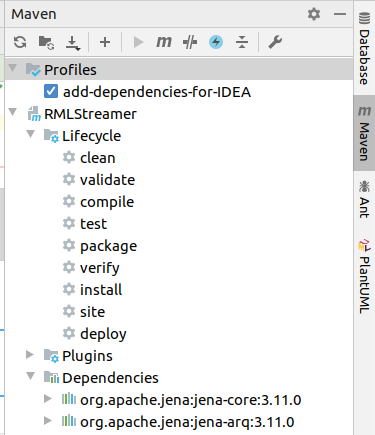

# Setting up RMLStreamer for development

## Prerequisites
* Git
* Java JDK >= 11
* Maven 3
* IntelliJ (Eclipse should work too, but consult Flink documentation for set-up)

## Setting up the environment (IntelliJ)
* Make sure you have the scala plugin installed and enabled in IntelliJ.
* Clone the repository.
* Open IntelliJ.
* Open `pom.xml` as a project.
* IntelliJ probably asks to automatically download the dependencies; this is generally a good idea.
* There should be a `Maven` tool window tab somewhere; open it. If not, you can open it via the menu: `View` > `Tool Windows` > `Maven`.
* Enable the profile `add-dependencies-for-IDEA`.

