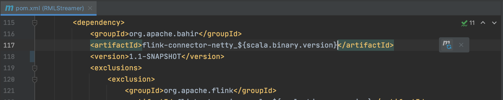
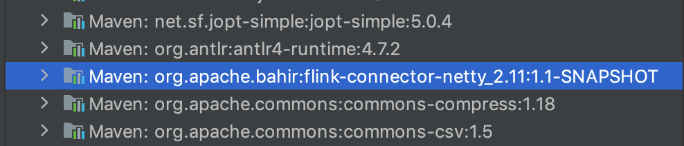

# README: Flink Netty Connector Snapshot

The `pom.xml` has been updated and swapped the old netty connector for the current snapshot. When using Intellij, it will ask to reload the dependencies. Click on it, after building you will see `flink-connector-netty_2.11:1.1-SNAPSHOT` will be added to the list of maven dependencies.

When updating the `pom.xml` file, the icon in the top right corner will ask to reload the decencies, which in this case will update to the snapshot.

Once you build with the newly updated `pom.xml`, the snapshot version will appear in the dependency list instead of the old version.

### Testing the build on a Flink 1.11 cluster

Download [Apache Flink 1.11.2 for Scala 2.11](https://www.apache.org/dyn/closer.lua/flink/flink-1.11.2/flink-1.11.2-bin-scala_2.11.tgz) from the [Apache Flink downloads page](https://flink.apache.org/downloads.html) and untar the file.

Make sure all function files are in place (see: [documentation](https://gitlab.ilabt.imec.be/rml/proc/rml-streamer/-/blob/development/documentation/README_Functions.md)) and execute the `flink-1.11.2/bin/start-cluster.sh`  and submit your job. Once you are done running all your jobs, stop the cluster by running the `flink-1.11.2/bin/stop-cluster.sh` script.

Normally no errors should occur.

### Using JitPack to get the latest Netty Snapshot

Since there is no recent official release of Bahir-Flink-Netty, [JitPack](https://jitpack.io/) is used to get the latest snapshot. JitPack is a tool that can get you the a snapshot build from a GitHub/GitLab repo and use it with several build toos including Maven. The usage is very simple, go to the repo you want to use and copy the link and paste it in JitPack. Choose a build, release or commit you want to use and click on 'Get it'. After a couple seconds the the build will be ready and you van copy the `pom.xml` patches.

1. Copy the repo url

   

2. Paste the repo url and look up the repo on JitPack

   

3. Get the build, commit, ... you need

   

4. Copy the `pom.xml` patches

   

