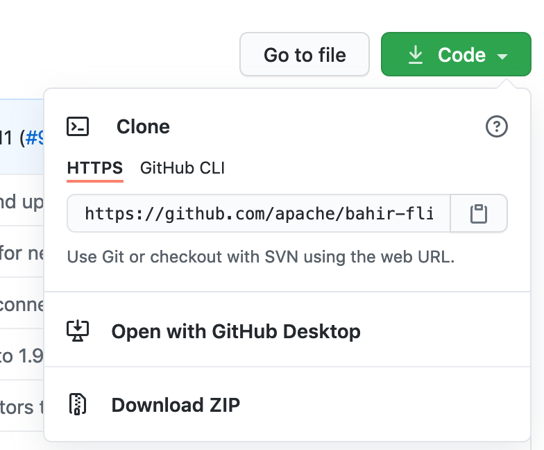
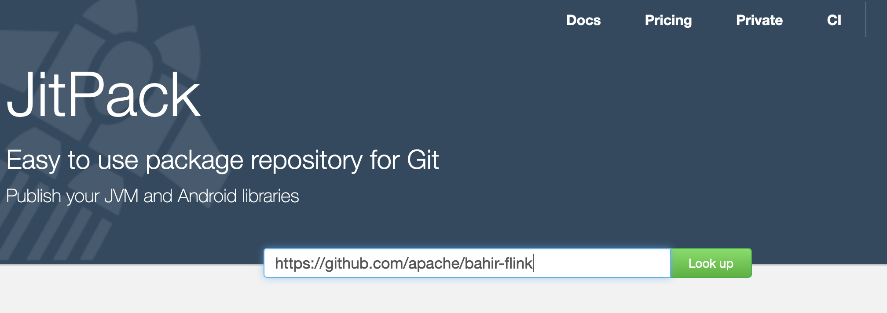
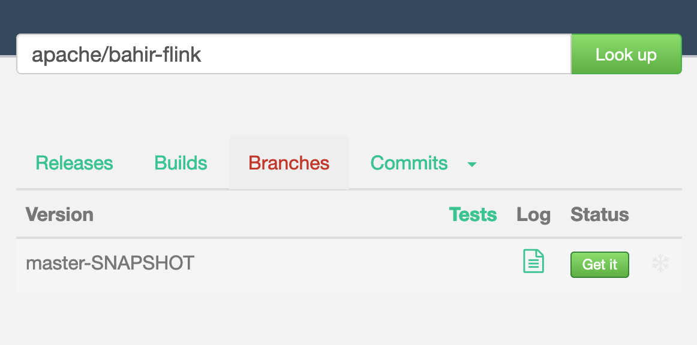
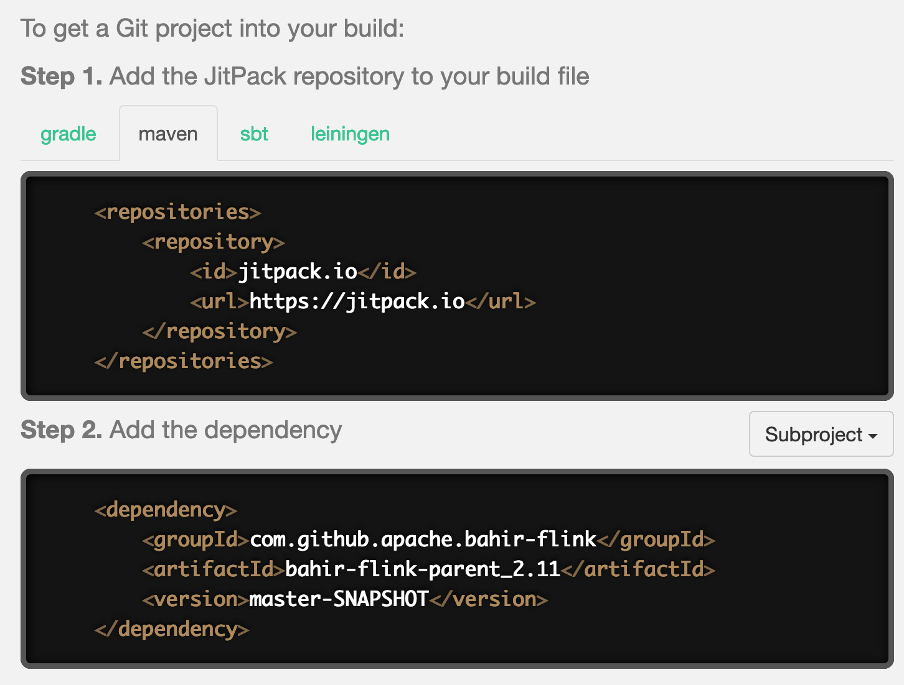
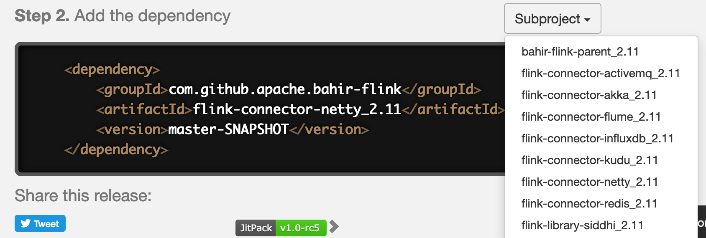

# README: Using JitPack
(kept for reference only, not applicable anymore for RMLStreamer)

### Using JitPack to get unpublished Maven Dependencies from a GitHub/GitLab repository

If you want to use a Maven dependency that is not yet published on Maven Central or you want a specific version, [JitPack](https://jitpack.io/) can be used to get a specific snapshot from the GitHub/GitLab repository. Using JitPack is very simple, you simly go to the GitHub/GitLab repository and copy its link and paste on the JitPack site. Select the version and build system and get the config generated by JitPack. At the moment, this project uses JitPack for Bahir-Flink.

### Step by step by step example

In this example the maven dependency [Bahir-Flink](https://github.com/apache/bahir-flink) is built via JitPack.

1. Copy the url of the repository you want to use.

   

2. Paste the repository url and look up the repo on JitPack.

   

3. Select the build, commit, ... you need.

   

4. Copy the `pom.xml` patches and paste them in the `pom.xml` of your project.

   

When using a repository that contains different subprojets, you can also select one of those subprojets, instead of the entire project. In this example the `flink-netty-connector` subproject is selected from the Bahir-Flink repository.

